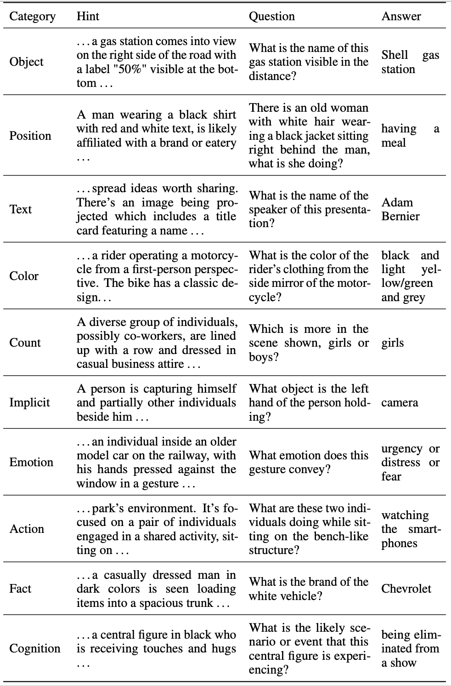

### Vript Dataset
```
Vript/
|
├── vript_meta/
│   ├── vript_long_videos_meta.json 
│   └── vript_short_videos_meta.json
│
├── vript_captions/
│   ├── vript_long_videos_captions.zip
│   │   ├── 007EvOaWFOA_caption.json
│   │   └── ...
│   └── vript_short_videos_captions.zip
│       └── ...
│
├── vript_long_videos/
│   ├── video_1_of_1095.zip 
│   │   ├── 007EvOaWFOA.mp4
│   │   └── ...
│   ├── video_2_of_1095.zip
│   └── ...
│
├── vript_short_videos/
│   ├── short_video_1_of_42.zip 
│   │   ├── 02toZL7p4_0.mp4
│   │   └── ...
│   ├── short_video_2_of_42.zip
│   └── ...
│
├── vript_long_videos_clips/
│   ├── clips_1_of_1095.zip 
│   │   ├── 007EvOaWFOA/
│   │   │   ├── 007EvOaWFOA_cut_meta.json
│   │   │   ├── 007EvOaWFOA_asr.jsonl
│   │   │   ├── 007EvOaWFOA-Scene-001.mp4
│   │   │   └── ...
│   │   └── ...
│   ├── clips_2_of_1095.zip
│   └── ...
│
└── vript_short_videos_clips/
    ├── shorts_clips_1_of_42.zip 
    │   ├── 02toZL7p4_0/
    │   │   ├── 02toZL7p4_0_cut_meta.json
    │   │   ├── 02toZL7p4_0_asr.jsonl
    │   │   ├── 02toZL7p4_0-Scene-001.mp4
    │   │   └── ...
    │   └── ...
    ├── shorts_clips_2_of_42.zip
    └── ...
```
- `vript_meta/`: The meta information of the videos in the Vript dataset, including the video id, title, url, description, category, etc.

- `vript_captions/`: The video captions of the videos in the Vript dataset. The structure of the caption file is as follows:
```
{
    "meta": {
        "video_id": "339dXVNQXac",
        "video_title": "...",
        "num_clips": ...,
        "integrity": true,
    },
    "data": {
            "339dXVNQXac-Scene-001": {
                "video_id": "339dXVNQXac",
                "clip_id": "339dXVNQXac-Scene-001",
                "video_title": "...",
                "caption":{
                    "shot_type": "...",
                    "camera_movement": "...",
                    "content": "...",
                    "scene_title": "...",
                },
                "voiceover": ["..."],
            },
            "339dXVNQXac-Scene-002": {
                ...
            }
        }
}
```

- `vript_long_videos/` (667 GB) and `vript_short_videos/` (8.8 GB): The untrimmed videos in the Vript dataset. Long videos are from YouTube, and short videos are from YouTube Shorts and TikTok. We divide the whole data into multiple zip files, each containing 10 long videos / 50 short videos.


    All the videos are in **720p** resolution, and _we will provide the videos in the highest quality (up to 2K) available later_ (or you can download them from YouTube directly).

- `vript_long_videos_clips/` (822 GB) and `vript_short_videos_clips/` (12 GB): The trimmed video clips in the Vript dataset, which correspond to scenes in the `video_captions`. 

- `xxx_cut_meta.json`: The meta information about how the video is trimmed, including the start time, end time, and the duration of the scene.

- `xxx_asr.jsonl`: The transcription of the voice-over in the scene.

_Warning: Some zip files may contain empty folders. You can ignore them as these folders have no video clips and no annotation files._

### Vript-Bench

#### Vript-HAL
```
Vript-HAL/
|
├── HAL_scenes/
│   ├── -_MRAAhEKio-Scene-010.mp4
│   └── ...
│  
└── HAL_annotations.jsonl
```

- `HAL_scenes.zip`: The trimmed video clips in the Vript-HAL benchmark.

- `HAL_annotations.jsonl`: The annotations of the Vript-HAL benchmark. The structure of the annotation file is similar to the `vript_captions` in the Vript dataset. 

#### Vript-RR

<p align="center">
  
</p>


```
Vript-RR/
|
├── RR_videos/
│   ├── -_MRAAhEKio.mp4
│   └── ...
│
├── RR_scenes/
│   ├── -_MRAAhEKio-Scene-010.mp4
│   └── ...
│
└── RR_annotations.jsonl
```
- `RR_videos.zip`: The untrimmed videos in the Vript-RR benchmark.

- `RR_scenes.zip`: The trimmed video clips in the Vript-RR benchmark, which correspond to scenes in the `RR_annotations`.

- The `RR_annotations.jsonl`: It contains all the annotations in the Vript-RR benchmark, which can be previewed in the [Vript-RR](https://huggingface.co/datasets/Mutonix/Vript-RR) on Huggingface.

#### Vript-ERO
``` 
Vript-ERO/
|
├── ERO_annotations.jsonl
|
├── ERO_scenes/
│   ├── -_MRAAhEKio-Scene-010.mp4
│   └── ...
│
└── ERO_videos/
    ├── -_MRAAhEKio-Scene-010.mp4
    └── ...

```
- `ERO/`: The annotations of the Vript-ERO benchmark. The `ERO_annotations.jsonl` files contains all the annotations in the Vript-ERO benchmark, which can be previewed in the [Vript-ERO](https://huggingface.co/datasets/Mutonix/Vript-ERO) on Huggingface.

- `ERO_scenes`: The trimmed video clips in the Vript-ERO benchmark, which correspond to scenes in the `ERO` annotations.