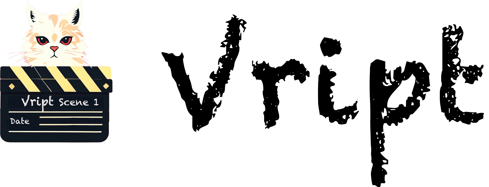
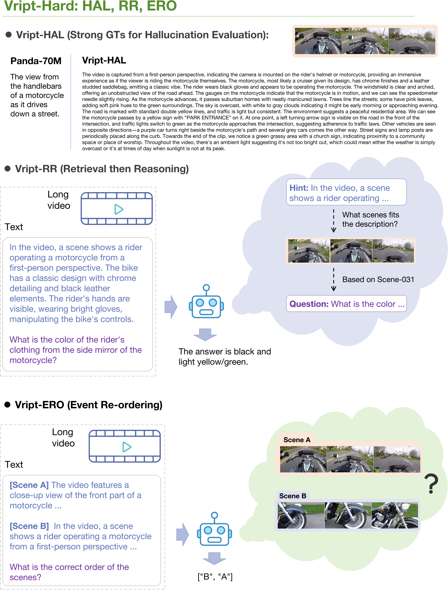
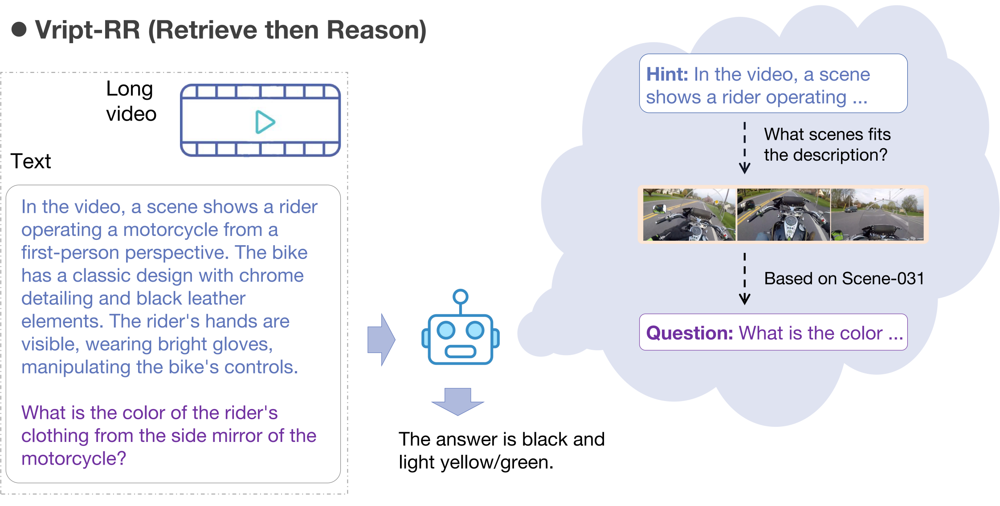
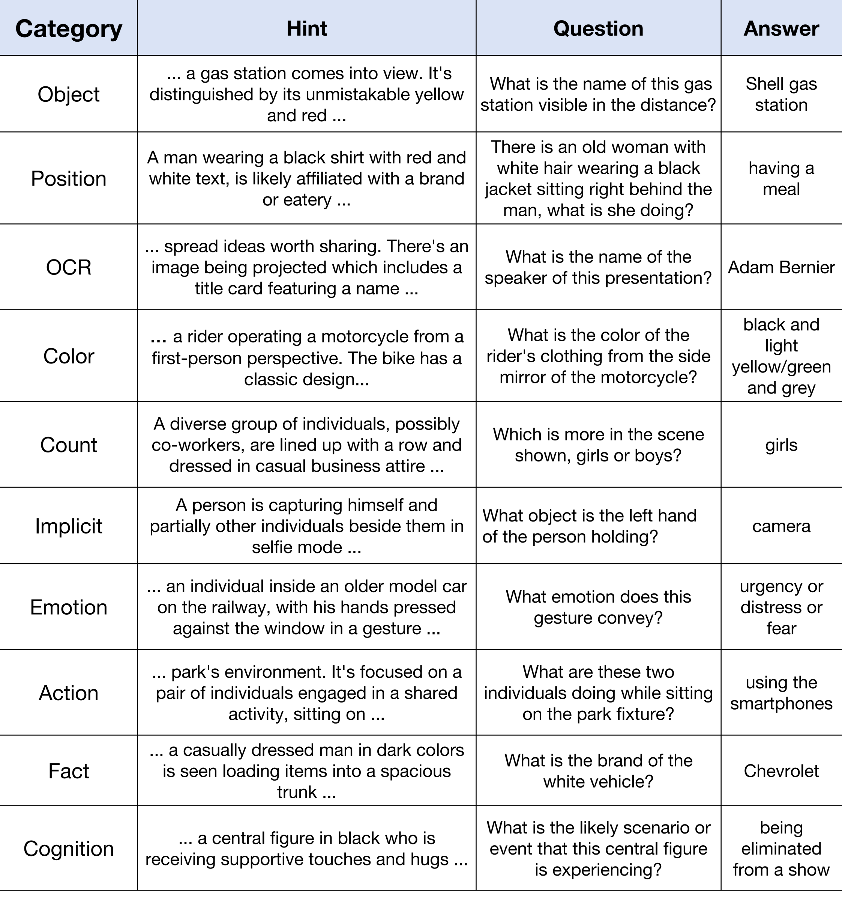

<p align="center">

</p>


# 🎬 Vript: A Video Is Worth Thousands of Words
---

## Updates
[TOP] 🔥🔥🔥 **2024-10-16**: **We release the **[Vript_Multilingual](https://huggingface.co/datasets/Mutonix/Vript_Multilingual/)** dataset.** In Vript_Multilingual, we annotate the 19.1K UGC videos (~667K clips) with multiple languages. Each caption contains over 150 words. You can explore and download the dataset on the [🤗](https://huggingface.co/datasets/Mutonix/Vript_Multilingual/) now.

**New in Vript_Multilingual**: 
1. Multilingual captions: zh (60%), en (17%), de (15%), ja (6%), ko (2%), ru (<1%), es (<1%), pt (<1%), jv (<1%), fr (<1%), id (<1%), vi (<1%)
2. More diverse and fine-grained categories: 113 categories (please check `tname` in [vript_CN-V2_meta.json](https://huggingface.co/datasets/Mutonix/Vript_Multilingual/blob/main/vript_CN-V2_meta.jsonl))
3. Wider range: from 2011-01 to 2024-06
4. Higher resolution: 1080p
5. Longer duration: > 10 minutes in average
6. More clips: ~677k clips

---


- 🎉🎉🎉 **2024-09-28**： Our paper [Vript: A Video Is Worth Thousands of Words](https://arxiv.org/abs/2406.06040) is accepted as poster in Neurips 2024 in Dataset & Benchmark track.


- 🔥 **2024-06-15**: **We release the **[Vript_Chinese](https://huggingface.co/datasets/Mutonix/Vript_Chinese/)** dataset, a Chinese version of the Vript dataset with most detailed Chinese captions.** In Vript_Chinese, we annotate the 44.7K Chinese videos (~293K clips) with Chinese directly. Each caption contains over 200 Chinese characters. You can explore and download the dataset on the [🤗](https://huggingface.co/datasets/Mutonix/Vript_Chinese/) now.

- 🔥 **2024-06-23**: We open-source the code for training the superior video captioning model, **Vriptor-STLLM**, and [weights](https://huggingface.co/Mutonix/Vriptor-STLLM) for inference. Please check the instructions [here](https://github.com/mutonix/Vript/tree/main/vriptor).

- 🔥 **2024-06-18**: We give a full pipeline about evaluating your models on Vript-Hard and examples for each task. Please follow the instructions [here](#how-to-evaluate-on-vript-hard).

- **2024-06-14**: We provide the Vript dataset on the [ModelScope](https://modelscope.cn/datasets/mutonix/Vript/) now! You can view the dataset and download the videos on the ModelScope if you can not access the Huggingface.

- 🔥 **2024-06-11**: We release our paper [Vript: A Video Is Worth Thousands of Words](https://arxiv.org/abs/2406.06040). Please check the paper for more details.


- 🔥 **2024-05-09**: We release **Vriptor-stllm**, a superior video captioning model trained upon [Vript](https://huggingface.co/datasets/Mutonix/Vript/) dataset based on [ST-LLM](https://github.com/TencentARC/ST-LLM/) model. **You can now try this model on the [🤗 Space](https://huggingface.co/spaces/Mutonix/Vriptor-stllm).** We will soon release the model weight.


- 🔥 **2024-04-15**: We release the **Vript** dataset and **Vript-Hard** benchmark. Both videos and annotations are **directly** available on the [🤗](https://huggingface.co/collections/Mutonix/vript-datasets-661a80dc080a813b6ea95b50). We offer both untrimmed videos and video clips in 720p (higher resolutions may be available later).

- [WIP] We are evaluating various models on the Vript-Hard benchmark and will release the leaderboard soon.

## Introduction
Advancements in multimodal learning, particularly in video understanding and generation, require high-quality video-text datasets for improved model performance. Vript addresses this issue with a meticulously annotated corpus of 12K high-resolution videos, offering detailed, dense, and script-like captions for over 420K clips. Each clip has a caption of ~145 words, which is over 10x longer than most video-text datasets. Unlike captions only documenting static content in previous datasets, we enhance video captioning to video scripting by documenting not just the content, but also the camera operations, which include the shot types (medium shot, close-up, etc) and camera movements (panning, tilting, etc). By utilizing the Vript, we explore three training paradigms of aligning more text with the video modality rather than clip-caption pairs. This results in Vriptor, a top-performing video captioning model among open-source models, comparable to GPT-4V in performance. Vriptor is also a powerful model capable of end-to-end generation of dense and detailed captions for long videos. Moreover, we introduce Vript-Hard, a benchmark consisting of three video understanding tasks that are more challenging than existing benchmarks: Vript-HAL is the first benchmark evaluating action and object hallucinations in video LLMs, Vript-RR combines reasoning with retrieval resolving question ambiguity in long-video QAs, and Vript-ERO is a new task to evaluate the temporal understanding of events in long videos rather than actions in short videos in previous works. 

There are some takeaways from the Vript dataset:

1) **Fine-grained**: The Vript dataset is annotated with detailed captions of ~145 words for each scene, which contain the shot type, camera movement, content, and scene title.

2) **Dense Annotation**: The Vript dataset is densely annotated with detailed captions for all scenes in the entire videos. Each video has ~40 scenes and lasts for ~6m on average (max 3h, min 5s). The total duration of the videos is ~1.3Kh.

3) **High-quality**: The Vript dataset is annotated by GPT-4V/Claude 3 Sonnet. We find that GPT-4V has the best performance in generating detailed captions for videos and Claude 3 Sonnet has a looser constraint on the video content so that it can caption some scenes that GPT-4V cannot.

4) **High-resolution & Diverse Aspect Ratios & Open Domain**: The Vript dataset contains both long videos from YouTube and short videos from YouTube Shorts and TikTok. The raw videos vary in 720p to 2K resolution.

In addition, we propose **Vript-Hard**, a new benchmark consisting of three challenging video understanding tasks **that much harder than the existing video understanding benchmarks.**:

1) **Vript-HAL (Hallucination Evaluation)**: The first benchmark to comprehensively evaluate object and action hallucinations in video LLMs, providing the detailed ground truth 25x longer than MSR-VTT.

2) **Vript-RR (Retrieval then Reasoning)**: A long video reasoning task by giving a hint for locating the relevant scene and then asking questions about the scene. Vript-RR features harder questions that need multi-hop reasoning and longer videos (2min~40min) than previous long video benchmarks, e.g., EgoSchema (3min).

3) **Vript-ERO (Event Re-ordering)**: A benchmark that tests the temporal understanding of long videos by offering the descriptions of scenes located in three different timestamps of the same video, and asks the model to give the right temporal order of the scenes. In Vript-ERO, each video contains over 40 scenes on average.

$\quad$

<p align="center">
  
</p>

$\quad$

<p align="center">

</p>


## Getting Started
You can download the [Vript dataset](https://huggingface.co/datasets/Mutonix/Vript/) and Vript-Hard validation set ([Vript-HAL](https://huggingface.co/datasets/Mutonix/Vript-HAL/), [Vript-RR](https://huggingface.co/datasets/Mutonix/Vript-RR/), [Vript-ERO](https://huggingface.co/datasets/Mutonix/Vript-ERO/)) on the Huggingface.
**By downloading these datasets, you agree to the terms of the [License](#License).**

The captions of the videos in the Vript dataset are structured as follows:
```
{
    "meta": {
        "video_id": "339dXVNQXac",
        "video_title": "...",
        "num_clips": ...,
        "integrity": true, 
    },
    "data": {
            "339dXVNQXac-Scene-001": {
                "video_id": "339dXVNQXac",
                "clip_id": "339dXVNQXac-Scene-001",
                "video_title": "...",
                "caption":{
                    "shot_type": "...",
                    "camera_movement": "...",
                    "content": "...",
                    "scene_title": "...",
                },
                "voiceover": ["..."],
            },
            "339dXVNQXac-Scene-002": {
                ...
            }
        }
}
```
- `video_id`: The ID of the video from YouTube.
- `video_title`: The title of the video.
- `num_clips`: The number of clips in the video. If the `integrity` is `false`, some clips may not be captioned.
- `integrity`: Whether all clips are captioned.
- `clip_id`: The ID of the clip in the video, which is the concatenation of the `video_id` and the scene number.
- `caption`: The caption of the scene, including the shot type, camera movement, content, and scene title.
- `voiceover`: The transcription of the voice-over in the scene.


More details about the dataset and benchmark can be found in the [DATA.md](DATA.md).

## How to evaluate on Vript-Hard
### Get the prediction of your model
**A quick start of evaluating VideoChat2**
For fair comparison, please evaluate your own model on the Vript-Hard benchmark using these evaluation prompts in [here](https://github.com/mutonix/Vript/tree/main/vript-hard/evaluation_prompts/).

We provide an example of evaluating the VideoChat2 model on Vript-Hard. First of all, you have to set up the Videochat2 codebase and environment following [the instructions of Videochat2](https://github.com/OpenGVLab/Ask-Anything/tree/main/video_chat2).

Next, copy our [evaluation python files](https://github.com/mutonix/Vript/tree/main/vript-hard/models/videochat2) to the `Ask-Anything/video_chat2` and run the evaluation command. For example, you can evaluate the Videochat2 model on the Vript-RR benchmark using the following commands:
```
cd Ask-Anything/video_chat2
cp /path_to_Vript/Vript/vript-hard/models/videochat2/videochat2_vriptRR.py ./

python videochat2_vriptRR.py \
    --model_path your_path_to_model/videochat2_7b_stage3.pth \
    --rr_data_path your_path_to_rr_dataset \
    --output_filename_video your_path_to_output/RR_video_output.csv \
    --output_filename_clip your_path_to_output/RR_clip_output.csv
```

In the above example, we format the prediction of the model as the one in the [output example](http://github.com/mutonix/Vript/tree/main/vript-hard/evaluation_output_examples/), which is a csv file. The csv file should contain the following columns:
- `id`: The ID of the video or clip.
- `pred`: The prediction of the model.
- `gt`: [Optional] The ground truth answers. If they are not provided, we will used the ground truth answers automatically downloaded from the Huggingface.

<!-- 
#### Vript-RR (Retrieve then Reason)
<p align="center">

</p> -->

#### PS: Further illustration of evaluating on Vript-RR
1. **Input of Vript-RR**
There are two ways to evaluate on the Vript-RR benchmark:

    - `Vript-RR-whole` Task: 
    ```
    Input: `whole video` + `question` + `hint`
    ```
    We input the whole video along with the question and hint. The model can first locate the scene using the hint and then answer the question, which is more challenging.

    - `Vript-RR-clip` Task:
    ```
    Input: `clip` + `question` + `hint`
    ```
    We input the related scene instead of the whole video along with the question and hint. The model can answer the question based on the related scene, which is more easy.

2. **Output of Vript-RR**
    There are also two ways to evaluate the output of the Vript-RR benchmark:
    - Multiple Choices.
    - Open-ended. (The verification of open-ended questions based on GPT-4 evaluation can be checked in [here](http://github.com/mutonix/Vript/tree/main/vript-hard/scripts/run_verify_RR_openended.sh).)


### Verify the prediction
1. First of all, you need to install the requirements:
```
conda create -n vript python=3.8 -y
conda activate vript
pip install -r requirements.txt
python -m spacy download en_core_web_lg
```
2. Then, you can verify the output of your model on the Vript-Hard benchmark using the scripts in [here](http://github.com/mutonix/Vript/tree/main/vript-hard/scripts).

Except for the Vript-RR open-ended verification, you can **directly** run the following commands to have a try (We have provided the examples for an easy start). For RR open-ended verification, you should configure your GPT-4-turbo API key.
```
cd vript-hard/scripts

# Verify the output of Vript-HAL
bash run_verify_HAL.sh

# Verify the output of Vript-RR (Multiple Choices)
bash run_verify_RR.sh

# Verify the output of Vript-RR (Open-ended)
bash run_verify_RR_openended.sh 

# Verify the output of Vript-ERO
bash run_verify_ERO.sh
```

### Categories in Vript-RR
<p align="center">

</p>


## Annotation Details
### Prompt
```python
title = video_info["title"]
if title:
    title_instruction = f'from a video titled "{title}" '
else:
    title_instruction = ""

for scene in scene_dir:
    content = []
    voiceover_instruction = ""
    if scene in voiceovers_dict and 'short' not in args.video_dir:
        voiceover = voiceovers_dict[scene]
        if voiceover['full_text'].strip():
            voiceover_text = voiceover['full_text'].strip() 
            content.append({"type": "text", "text": f"Voice-over: {voiceover_text}\nVideo frames:"})
            voiceover_instruction = "voice-over and "
        else:
            voiceover_text = ""
    else:
        voiceover_text = ""

    scene_imgs = os.listdir(os.path.join(args.video_dir, vdir, scene))
    scene_imgs = [i for i in scene_imgs if i.endswith(".jpg")]
    scene_imgs = sorted(scene_imgs, key=lambda x: int(x.split('.')[0].split('_')[-1]))
    encoded_scene_imgs = []
    for scene_img in scene_imgs:
        encoded_scene_img = encode_image(os.path.join(args.video_dir, vdir, scene, scene_img))
        encoded_scene_imgs.append(encoded_scene_img)
        content.append({"type": "image_url", "image_url": {"url": f"data:image/jpeg;base64,{encoded_scene_img}", "detail": "low"}})

            content.append({"type": "text", "text": f"""
Based on the {voiceover_instruction}successive frames {title_instruction}above, please describe:
1) the shot type (15 words)
2) the camera movement (15 words)
3) what is happening as detailed as possible (e.g. plots, characters' actions, environment, light, all objects, what they look like, colors, etc.) (150 words)   
4) Summarize the content to title the scene (10 words)
Directly return in the json format like this:
{{"shot_type": "...", "camera_movement": "...", "content": "...", "scene_title": "..."}}. Do not describe the frames individually but the whole clip.
"""})
            
    messages=[
        {
            "role": "system",
            "content": "You are an excellent video director that can help me analyze the given video clip."
        },
        {
            "role": "user",
            "content": content
        }
    ]
```

### Sampling Strategy
```python
duration_time = total_frames / fps

# if duration < 6s
if duration_time < 6:
    # extract 20% 50% 80% frame
# if duration < 30s
elif duration_time < 30:
    # extract 15% 40% 60% 85% frame
else:
    # extract 15% 30% 50% 70% 85% frame
```

Thanks to [PySceneDetect](https://github.com/Breakthrough/PySceneDetect) for dividing the video into scenes.

## License
By downloading or using the data or model, you understand, acknowledge, and agree to all the terms in the following agreement.

- ACADEMIC USE ONLY

Any content from Vript/Vript-Hard dataset and Vriptor model is available for academic research purposes only. You agree not to reproduce, duplicate, copy, trade, or exploit for any commercial purposes

- NO DISTRIBUTION

Respect the privacy of personal information of the original source. Without the permission of the copyright owner, you are not allowed to perform any form of broadcasting, modification or any other similar behavior to the data set content.

- RESTRICTION AND LIMITATION OF LIABILITY

In no event shall we be liable for any other damages whatsoever arising out of the use of, or inability to use this dataset and its associated software, even if we have been advised of the possibility of such damages.

- DISCLAIMER

You are solely responsible for legal liability arising from your improper use of the dataset content. We reserve the right to terminate your access to the dataset at any time. You should delete the Vript/Vript-Hard dataset or Vriptor model if required.

You must comply with all terms and conditions of these original licenses, including but not limited to the OpenAI Terms of Use, the Copyright Rules & Policies of YouTube or TikTok and the specific licenses for base language models for checkpoints (e.g. Llama-1/2 community license, Vicuna, and ST-LLM). This project does not impose any additional constraints beyond those stipulated in the original licenses.

This license is modified from the [HD-VG-100M](https://github.com/daooshee/HD-VG-130M) license.


## Citation
```
@misc{yang2024vript,
      title={Vript: A Video Is Worth Thousands of Words}, 
      author={Dongjie Yang and Suyuan Huang and Chengqiang Lu and Xiaodong Han and Haoxin Zhang and Yan Gao and Yao Hu and Hai Zhao},
      year={2024},
      eprint={2406.06040},
      archivePrefix={arXiv},
      primaryClass={cs.CV}
}
```

## Contact
**Dongjie Yang**: [djyang.tony@sjtu.edu.cn](djyang.tony@sjtu.edu.cn)