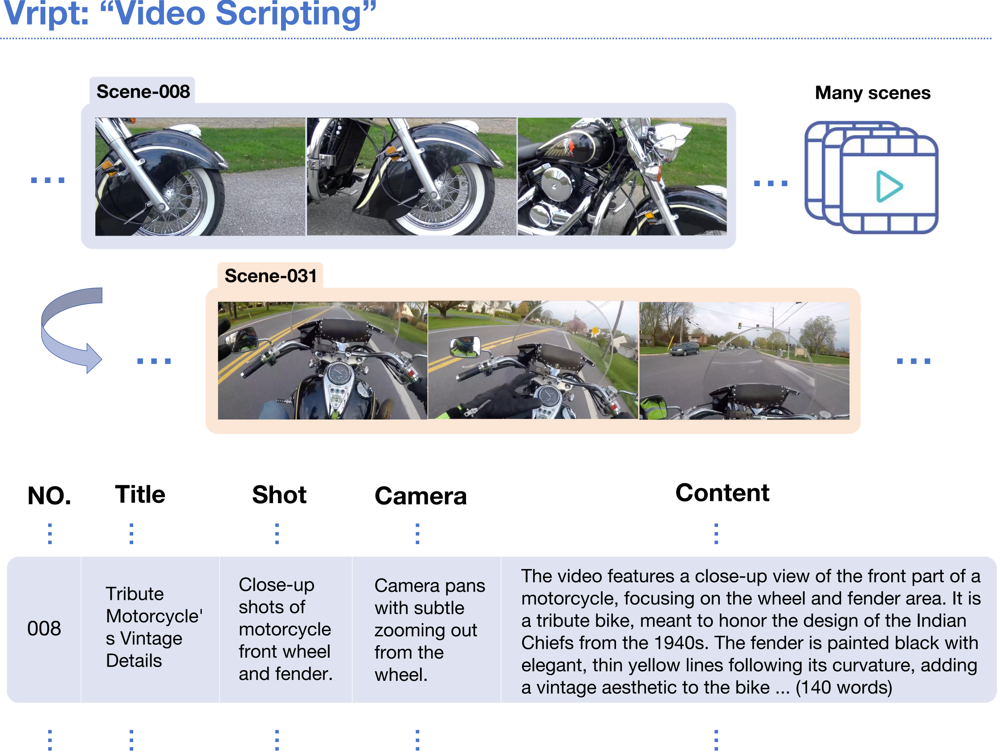
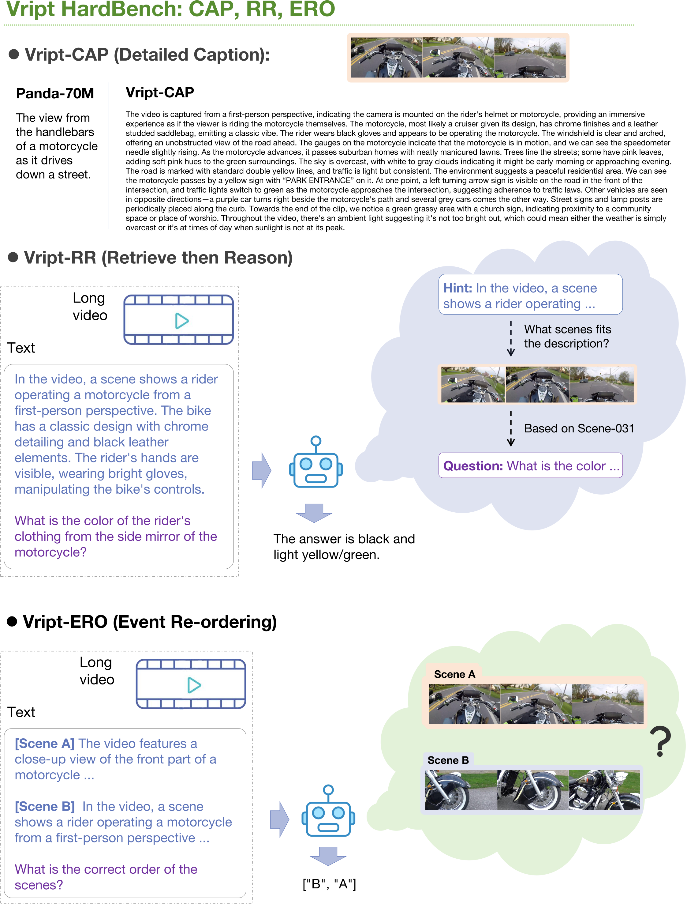

# 🎬 Vript: Refine Video Captioning into Video Scripting
---

## Introduction
We construct a **fine-grained** video-text dataset with 12K annotated high-resolution videos **(~400k clips)**. The annotation of this dataset is inspired by the video script. If we want to make a video, we have to first write a script to organize how to shoot the scenes in the videos. To shoot a scene, we need to decide the content, shot type (medium shot, close-up, etc), and how the camera moves (panning, tilting, etc). Therefore, we extend video captioning to video scripting by annotating the videos in the format of video scripts. Different from the previous video-text dataset, we densely annotate the entire video without discarding any scenes and each scene has a caption with **~145** words. Besides the vision modality, we transcribe the voice-over into text and put it along with the video title to give more background information for annotating the video.

In addition, we propose **Vript-Bench**, a new benchmark consisting of three challenging video understanding tasks **(which are carefully double-checked by humans)**: 

1) **Vript-CAP (Caption)**: A benchmark with detailed captions rather than short captions. 

2) **Vript-RR (Retrieve then Reason)**: A video reasoning benchmark by first giving a detailed description of the scene as a hint and then asking questions about details in the scene. 

3) **Vript-ERO (Event Re-ordering)**: A benchmark that tests the temporal understanding by offering the descriptions of scenes located in four different timelines of the same video, and asks the model to give the right temporal order of the scenes.

$\quad$

<p align="center">
  
</p>

$\quad$

<p align="center">

</p>

## Updates
- 🔥 **2024-04-15**: We release the **Vript** dataset and **Vript-Bench** benchmark. Both videos and annotations are available on [🤗](https://huggingface.co/collections/Mutonix/vript-datasets-661a80dc080a813b6ea95b50). We offer both untrimmed videos and video clips in 720p (higher resolutions may be available later).

- [WIP] We are working on the Vriptor, a better and lightweight model for video captioning based on Vript dataset, which will be released soon.

- [WIP] We are evaluating various models on the Vript-Bench benchmark and will release the leaderboard soon.

## Getting Started
You can download the [Vript dataset](https://huggingface.co/datasets/Mutonix/Vript/) and Vript-Bench validation set ([Vript-CAP](https://huggingface.co/datasets/Mutonix/Vript-CAP/), [Vript-RR](https://huggingface.co/datasets/Mutonix/Vript-RR/), [Vript-ERO](https://huggingface.co/datasets/Mutonix/Vript-ERO/)) on the Huggingface.
**By downloading these datasets, you agree to the terms of the [License](#License).**

The captions of the videos in the Vript dataset are structured as follows:
```
{
    "meta": {
        "video_id": "339dXVNQXac",
        "video_title": "...",
        "num_clips": ...,
        "integrity": true, 
    },
    "data": {
            "339dXVNQXac-Scene-001": {
                "video_id": "339dXVNQXac",
                "clip_id": "339dXVNQXac-Scene-001",
                "video_title": "...",
                "caption":{
                    "shot_type": "...",
                    "camera_movement": "...",
                    "content": "...",
                    "scene_title": "...",
                },
                "voiceover": ["..."],
            },
            "339dXVNQXac-Scene-002": {
                ...
            }
        }
}
```
- `video_id`: The ID of the video from YouTube.
- `video_title`: The title of the video.
- `num_clips`: The number of clips in the video. If the `integrity` is `false`, some clips may not be captioned.
- `integrity`: Whether all clips are captioned.
- `clip_id`: The ID of the clip in the video, which is the concatenation of the `video_id` and the scene number.
- `caption`: The caption of the scene, including the shot type, camera movement, content, and scene title.
- `voiceover`: The transcription of the voice-over in the scene.


More details about the dataset and benchmark can be found in the [DATA.md](DATA.md).

## License
By downloading or using the data or model, you understand, acknowledge, and agree to all the terms in the following agreement.

- ACADEMIC USE ONLY

Any content from Vript/Vript-Bench dataset and Vriptor model is available for academic research purposes only. You agree not to reproduce, duplicate, copy, trade, or exploit for any commercial purposes

- NO DISTRIBUTION

Respect the privacy of personal information of the original source. Without the permission of the copyright owner, you are not allowed to perform any form of broadcasting, modification or any other similar behavior to the data set content.

- RESTRICTION AND LIMITATION OF LIABILITY

In no event shall we be liable for any other damages whatsoever arising out of the use of, or inability to use this dataset and its associated software, even if we have been advised of the possibility of such damages.

- DISCLAIMER

You are solely responsible for legal liability arising from your improper use of the dataset content. We reserve the right to terminate your access to the dataset at any time. You should delete the Vript/Vript-Bench dataset or Vriptor model if required.

This license is modified from the [HD-VG-100M](https://github.com/daooshee/HD-VG-130M) license.


<!-- ## Citation
```
``` -->

## Contact
**Dongjie Yang**: [djyang.tony@sjtu.edu.cn](djyang.tony@sjtu.edu.cn)